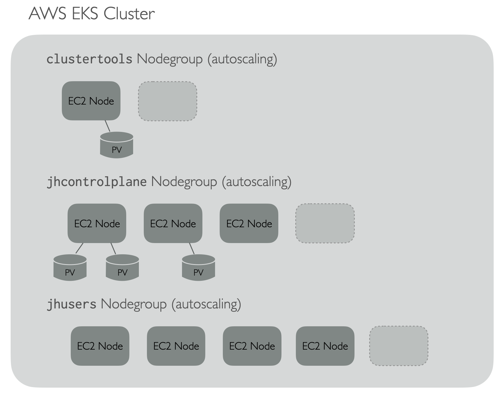
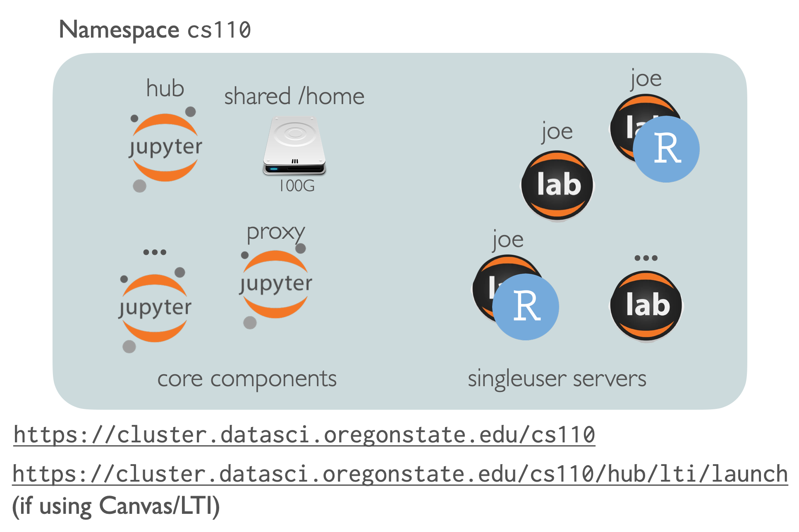

# Cluster Setup Info

Although this directory contains only a few files, this is a good place to 
overview high-level Kubernetes concepts as they pertain to this project (for a background tutorial 
on Kubernetes I highly recommend [The DevOps 2.3 Tookit](https://www.amazon.com/DevOps-2-3-Toolkit-highly-available-fault-tolerant/dp/1980690138) by 
Victor Farcic).

## Directory Contents

### eksctl

Configuration files for deploying kubernetes clusters with `eksctl`. Also some notes about AWS-specific setup and caveats (such as 
ingress and cluster auto-scaling setup, and potential gotchas with storage volumes). 

### grafana_prometheus

JSON model for monitoring JupyterHub deployments on clusters with Grafana backed by Prometheus. (Based partially on https://grafana.mybinder.org/.)

### velero

Script and resources for creating AWS S3 bucket for velero installs to point to.

## Kubernetes and JupyterHub

k8s for short, Kubernetes is a complex system for deploying and managing containers (usually Docker containers)
on a cluster of computers (often managed by a cloud service like AWS or Google Compute). 

Kubernetes clusters are made of one or more "Node Groups", which may individually scale up or down according to demand. (Where demand
is defined by the resources requested by pods (groups of containers), specifically CPU (in cores) and Memory (in bytes).)

Nodes in nodegroups may be annotated with "labels" to coordinate where containers may be scheduled. 

Persistent Volumes (PVs) of a given size 
may be requested by pods - these are backed by the cluster and may come in different types - on AWS they default to being backed by EBS volumes.
 
The connection between pods and the volumes is technically another kubernetes resource known a a PersistentVolumeClaim (PVC) - a PV can 
only be attached to a pod if there's no PVC already attaching it to another pod. Since AWS EBS volumes can only be attached to a single node, 
when a PVC is created connecting a pod to a volume kubernetes handles the job of ensuring that the pod containers run on the same node
as the volume, or detaches and re-attaches the PV (EBS vol) to a node where the pod can run. 

For reasons desribed below we use three nodegroups: a `clustertools` nodegroup, a `jhcontrolplane` nodegroup and a `jhusers` nodegroup. 
Pods accessing persistent volumes are not run on the jhusers nodegroup. Thus, the physical architecture looks like so:

### Applications and Nodegroups

The `clustertools` nodegroup is for running cluster-level tools: nginx-ingress, velero for backups, eksctl-autoscaler, grafana and prometheus (though prometheus also has a component that runs on every node of all groups for data collection). While this is configured as an autoscaling nodegroup, it rarely if ever should (and if it does it would be worth looking into why). 

The other two nodegroups are for running jupyterhub services. To understand the need for two nodegroups, it's worth considering all the pieces of a jupyterhub deployment:

Each JupyterHub "Hub" consists of multiple components (containers running within pods):

* "SingleUser Servers", each running the interfaces (JupyterLab, RStudio) and other computation (scripts, notebooks, etc.) for a single logged in user
  * These are designed to start and stop - users not logged in don't need a server running, since they are very fast to start up (containers)
* User placeholders - these are "fake" users that use up resources; when a real user logs in one of these is bumped to another node
  in the nodepool - if there's no room, the cluster autoscaler creates one automatically (which is a slow process, hence the
  placeholders: it's much better for a placeholder to wait on a new node than an actual user)
* "Core" components that, if disrupted, would prevent access to all hub members, including:
  * The "hub" which serves the login interface and runs a "culling" process, automatically shutting down singleuser servers not running
  * A proxy which helps map a specific hub's URLs to other components
  * A user-scheduler, which attempts to pack singleuser servers tightly on nodes, so that unused nodes can be auto-scaled down
  * A continuous-image-puller, which pre-pulls docker images (rather than forcing users to wait on them for their singleuser servers)
  * A persistent storage volume (provided by kubernetes) for storing a user information database (e.g. usernames and passwords), mounted by the main login hub 

#### Hub Storage

For data storage, the standard k8s-based JupyterHub creates a PersistentVolume (PV) and PersistentVolumeClaim (PVC) for each user when they first log in,
and attaches them to the singleuser servers when they start up. This project forgoes that, in favor of running an in-cluster NFS server per hub providing
shared storage (which is attached to each singleuser server when they start up via init processes). We thus add two other "Core" components:

* An nsf-server "drive" (pod)
* PV and PVC attached to the drive pod

The important point of these details is that the [docs](https://zero-to-jupyterhub.readthedocs.io/en/latest/administrator/optimization.html) 
suggest that singleuser servers run on their own nodegroup, so that the culling
process can stop them when inactive, and the cluster autoscaler can remove nodes when empty. Since core components are not interruptable (without
interrupting access for everyone), if they were run on the same nodegroup they would prevent scale-down. Hence the two nodegroups for hub-use: a difficult-to-scale-down `jhcontrolplane` nodegroup (but running lighter loads with less churn), and a more dynamic `jhusers` nodegroup. 

The charts are configured to target components to the appropriate nodegroup. 

## Kubernetes Namespaces

Kubernetes provides a concept of "namespaces" which logically isolate components placed into different namespaces (but still allows components
to be placed on different nodes and nodegroups). Kubernetes resources have "names" - the name for the Proxy component of a JupyterHub Hub is just "proxy".
Thus, to run multiple Hubs, it is necessary to run them in different namespaces (two hubs cannot live in the same namespace). 

Namespaces have names too (e.g. "johns-namespace") 
and these must be unique in a cluster 
(vanilla kubernetes clusters come with a "default" namespace and a "kube-system" namespace for things that run the cluster itself).
Cluster administrators can restrict access to and between
namespaces. Currently, the NFS server "drive" component of this project is designed to be run inside the same namespace as the hub accessing it. Cross-namespace
access may in the future provide for re-usable data across hubs (for example an instructor with two related classes but where each use the same
dataset examples), but security implications will need to be considered (to prevent cross-class data access where it shouldn't occur). 

Not all kubernetes resources are associated with a namespace: persistent volumes (PVs) are not, because they represent physical components 
(same for nodes). PVCs on the other hand do live in namespaces along with the pod they are associated with.

Cluster-level tools are generally deployed either in the `kube-system` namespace (that's a requirement of the autoscaler), `velero` (the default for velero), or otherwise `cluster-tools`. 

The base JupyterHub chart is constructed in such a way that *only one* jupyterhub may be deployed per-namespace, so we generally name the namespace the same as the overall hub "name", and this also corresponds to the access/launch URL (this is all setup by `hub_deploy.sh`).

 
