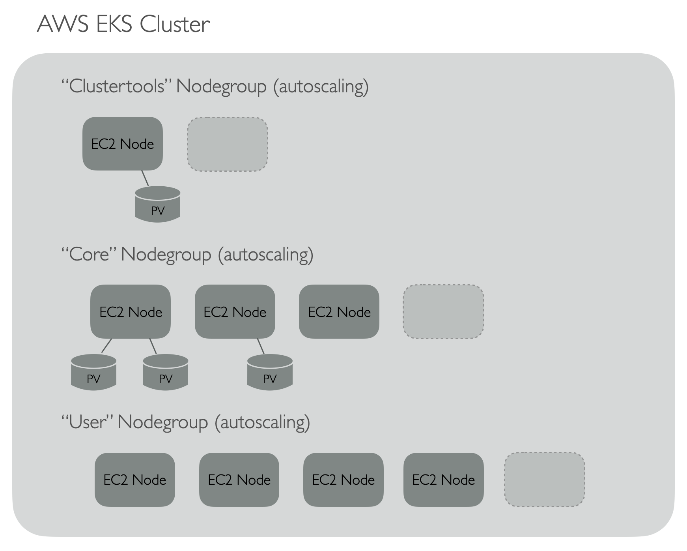
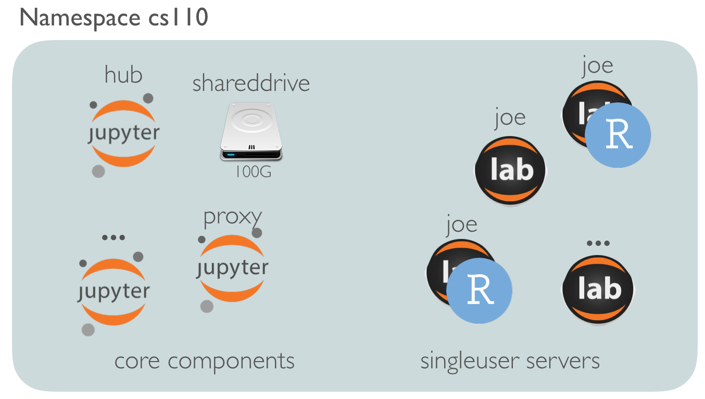
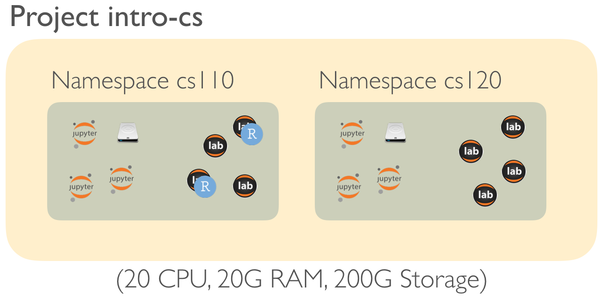
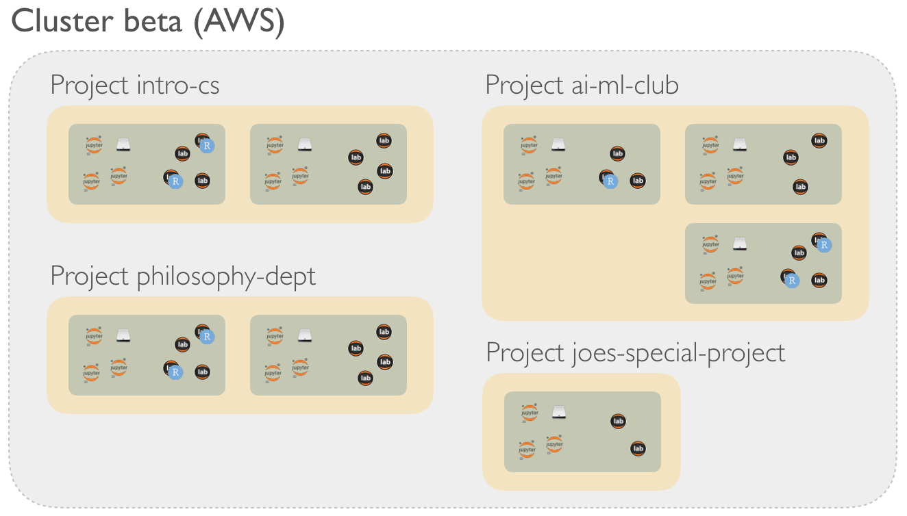
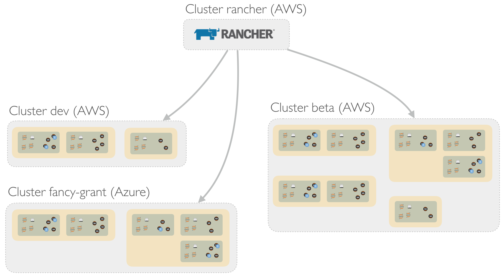

# Cluster Setup Info

Although this directory contains only a few files, this is a good place to 
overview high-level Kubernetes concepts as they pertain to this project (for a background tutorial 
on Kubernetes I highly recommend [The DevOps 2.3 Tookit](https://www.amazon.com/DevOps-2-3-Toolkit-highly-available-fault-tolerant/dp/1980690138) by 
Victor Farcic).

## Directory Contents

### eksctl

Configuration files for deploying kubernetes clusters with `eksctl`. Also some notes about AWS-specific setup and caveats (such as 
ingress and cluster auto-scaling setup, and potential gotchas with storage volumes). 

### grafana_prometheus

JSON model for monitoring JupyterHub deployments on clusters with Grafana backed by Prometheus. (Based partially on https://grafana.mybinder.org/.)

### velero

Script and resources for creating AWS S3 bucket for velero installs to point to.

## Kubernetes and JupyterHub

k8s for short, Kubernetes is a complex system for deploying and managing containers (usually Docker containers)
on a cluster of computers (often managed by a cloud service like AWS or Google Compute). 

Kubernetes clusters are made of one or more "Node Groups", which may individually scale up or down according to demand. (Where demand
is defined by the resources requested by pods (groups of containers), specifically CPU (in cores) and Memory (in bytes).)

Nodes in nodegroups may be annotated with "labels" to coordinate where containers may be scheduled. 

Persistent Volumes (PVs) of a given size 
may be requested by pods - these are backed by the cluster and may come in different types - on AWS they default to being backed by EBS volumes.
 
The connection between pods and the volumes is technically another kubernetes resource known a a PersistentVolumeClaim (PVC) - a PV can 
only be attached to a pod if there's no PVC already attaching it to another pod. Since AWS EBS volumes can only be attached to a single node, 
when a PVC is created connecting a pod to a volume kubernetes handles the job of ensuring that the pod containers run on the same node
as the volume, or detaches and re-attaches the PV (EBS vol) to a node where the pod can run. 

For reasons desribed below we use three nodegroups: a "cluster-tools" nodegroup, a "jhcontrolplane" nodegroup and a "jhusers" nodegroup. 
Pods accessing persistent volumes are not run on the jhusers nodegroup. Thus, the physical architecture looks like so:

### JupyterHub Hubs

Each JupyterHub "Hub" consists of multiple components (containers running within pods):

* "SingleUser Servers", each running the interfaces (JupyterLab, RStudio) and other computation (scripts, notebooks, etc.) for a single logged in user
  * These are designed to start and stop - users not logged in don't need a server running, since they are very fast to start up (containers)
* User placeholders - these are "fake" users that use up resources; when a real user logs in one of these is bumped to another node
  in the nodepool - if there's no room, the cluster autoscaler creates one automatically (which is a slow process, hence the
  placeholders: it's much better for a placeholder to wait on a new node than an actual user)
* "Core" components that, if disrupted, would prevent access to all hub members, including:
  * The "hub" which serves the login interface and runs a "culling" process, automatically shutting down singleuser servers not running
  * A proxy which helps map a specific hub's URLs to other components
  * A user-scheduler, which attempts to pack singleuser servers tightly on nodes, so that unused nodes can be auto-scaled down
  * A continuous-image-puller, which pre-pulls docker images (rather than forcing users to wait on them for their singleuser servers)
  * A persistent storage volume (provided by kubernetes) for storing a user information database (e.g. usernames and passwords), mounted by the main login hub 

### Hub Storage

For data storage, the standard k8s-based JupyterHub creates a PersistentVolume (PV) and PersistentVolumeClaim (PVC) for each user when they first log in,
and attaches them to the singleuser servers when they start up. This project forgoes that, in favor of running an in-cluster NFS server per hub providing
shared storage (which is attached to each singleuser server when they start up via init processes). We thus add two other "Core" components:

* An nsfserver "drive" (pod)
* PV and PVC attached to the drive pod

The important point of these details is that the [docs](https://zero-to-jupyterhub.readthedocs.io/en/latest/administrator/optimization.html) 
suggest that singleuser servers run on their own nodegroup, so that the culling
process can stop them when inactive, and the cluster autoscaler can remove nodes when empty. Since core components are not interruptable (without
interrupting access for everyone), if they were run on the same nodegroup they would prevent scale-down. 

## Kubernetes Namespaces

Kubernetes provides a concept of "namespaces" which logically isolate components placed into different namespaces (but still allows components
to be placed on different nodes and nodegroups). Kubernetes resources have "names" - the name for the Proxy component of a JupyterHub Hub is just "proxy".
Thus, to run multiple Hubs, it is necessary to run them in different namespaces (two hubs cannot live in the same namespace). 

Namespaces have names too (e.g. "johns-namespace") 
and these must be unique in a cluster 
(vanilla kubernetes clusters come with a "default" namespace and a "kube-system" namespace for things that run the cluster itself).
Cluster administrators can restrict access to and between
namespaces. Currently, the NFS server "drive" component of this project is designed to be run inside the same namespace as the hub accessing it. Cross-namespace
access may in the future provide for re-usable data across hubs (for example an instructor with two related classes but where each use the same
dataset examples), but security implications will need to be considered (to prevent cross-class data access where it shouldn't occur). 

Not all kubernetes resources are associated with a namespace: persistent volumes (PVs) are not, because they represent physical components 
(same for nodes). PVCs on the other hand do live in namespaces along with the pod they are associated with.

## Rancher

Rancher is a web-based GUI for managing Kubernetes clusters (potentially multiple on different cloud providers) and the kubernetes resources
that run on them. (Some screenshots for a slightly older version of Rancher [here](https://aws.amazon.com/blogs/opensource/managing-eks-clusters-rancher/)). It runs on kubernetes
itself; the documentation recommends running it on it's own dedicated cluster. (The [Rancher quickstart for AWS](https://rancher.com/docs/rancher/v2.x/en/quick-start-guide/deployment/amazon-aws-qs/) gives some info on getting setup from scratch, we're working on choosing our production Rancher deployment method.)

Rancher provides a number of benefits and niceties:

* Management of "App Catalogs" - essentially collections of [helm](https://helm.sh/) charts with additional added features for GUI-based installation.
  Helm charts are basically folders containing information on how to deploy lots of kubernetes resources at once to create a full "application",
  and help with customizing the setup without needing to edit just too much text. They also allow for making other charts "dependencies"
  of an application that might depend on other applications. The z2jh project is distributed as a helm chart, which we use as a dependency for
  a Rancher chart.
* Easy deployment of "Apps" (charts) with GUI-based configuration, and features for monitoring and updating components, viewing logs, etc.
* Easy installation of cluster-monitoring tools [Prometheus and Grafana](https://prometheus.io/docs/visualization/grafana/).
* Multiple-cluster management and installs
  * Beneficial in a multi-cloud environment
  * Also useful since cluster is the unit-of-cost; e.g. a grant with a specific budget could be hosted on an independent cluster
* The concept of "projects" - collections of namespaces with configurable total resource quotas (memory, CPU, storage). 

### Projects

The Rancher addition of projects aims to make kubernetes more "multitenant" - allowing for different admins to access a cluster but only
work with applications within their project, under constrained resource limits and security protections; John Smith might have a project "smith-john"
allocated 10 CPU cores, 20G of RAM, and 100G of storage (configure as he likes within namespaces and applications), while Jane Smith may have access
to both the "smith-john" project (as his supervisor) and her own "smith-jane" project with 
20 Cores, 50G of RAM, and 300G of storage. (We haven't thoroughly tested resource limits in our application.)

The abstraction is
not entirely perfect - namespace names must still be unique cluster-wide (so John and Jane can't both create a namespace called "test-jupyterhub"),
and the same goes for app names ("my-jupyterhub" can only be used by one Hub installation across the cluster). The former is a limitation of Rancher and kubernetes, 
the latter a limitation of Helm (which should soon be fixed when Rancher fully integrates the latest version of helm, helm3). Cross-project networking can be restricted for security,
but requires specific kubernetes configuration. 

We currently deploy two clusters (in addition to the small cluster dedicated to Rancher) - one for development ("dev"), and one for production use (currently
called "beta").

### Prometheus and Grafana

Prometheus is a metrics gathering tool frequently used with kubernetes clusters to evaluate cluster state over time. Grafana is a web-based data visualization
tool frequently used for creating dashboards to query and evaluate prometheus data (or other data sources such as SQL). Together they are a common
solution for tracking the usage and health of kubernetes clusters. 

Rancher provides for one-click deployment of these tools to Rancher-managed clusters; see the [docs](https://rancher.com/docs/rancher/v2.x/en/cluster-admin/tools/monitoring/)
for steps to enable. The components are deployed as "Apps" to the System namespace of the cluster. 

Note that Grafana is user-aware, multiple users can be created with different access permissions; the default Admin username/password is `admin`/`admin` - 
be sure to log in and change it after enabling monitoring for a cluster. (See details in `eksctl` README.)

### Rancher and AWS Caveats

Rancher has built-in capabilities for deploying clusters to AWS EKS, AWS EC2 nodes directly, Microsoft Azure, and other cloud providers. 
I've only tested against 
AWS EKS and AWS EC2, but haven't found the experience to be smooth: the AWS-based cluster setup by Rancher were lacking in AWS-specific storage classes. 
(Maybe a mismatch between Rancher and EKS versions?)

However, Rancher also provides an "import existing cluster" method - I've found in general that deploying a Kubernetes cluster via-cloud specific
tools (such as `eksctl` for AWS) and then importing them into Rancher to be much smoother. 

Note that there are also some EKS + `eksctl`-specific caveats to deploying kubernetnes in AWS which are covered in more detail in the `eksctl` directory README.
(It may be worth looking into another deployment tool such as [kops](https://github.com/kubernetes/kops).)

## Logical Overview

The logical organization is thus quite nested. At the lowest level, we have a namespace which can host a single Hub and it's various components (or potentially
in the future other applications):

Multiple namespaces may share a project, for example, if we wish to limit the total resources used by an instructor (or department) running multiple 
hubs:

Projects exist within a cluster on a cloud host (AWS, Google, Azure, On-Prem) (not withstanding Rancher's support for [multicluster](https://rancher.com/docs/rancher/v2.x/en/catalog/multi-cluster-apps/) applications and projects):

Finally at the system level we have the small cluster running Rancher and multiple clusters such as "beta" and "dev", or others, even across different clouds.

There are a number of potential schemes for accessing a specific Hub URL:

* `https://cluster.datasci.oregonstate.edu/project/namespace`
* `https://datasci.oregonstate.edu/cluster/project/namespace/hub`
* ...

### URLs

Because namespaces must be unique within a cluster (and application names until Rancher updates to use helm 3) and a single namespace can only host one Hub, and
due to some choices around SSL certs and the ingress controller, we're using 

* `https://cluster.datasci.oregonstate.edu/namespace`, e.g. `https://beta.datasci.oregonstate.edu/cs110` 

 
