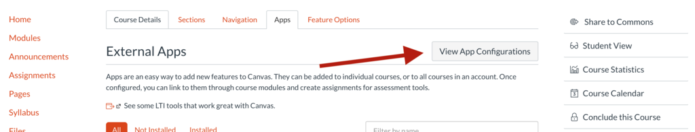
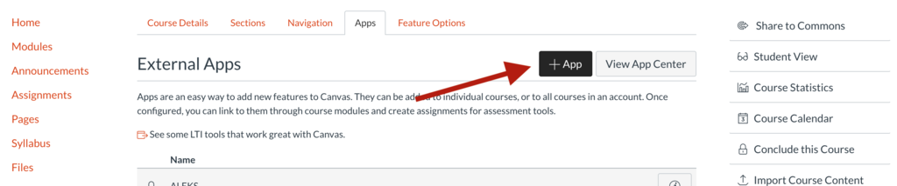
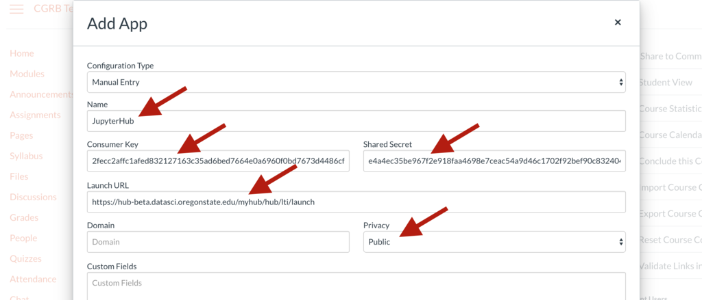
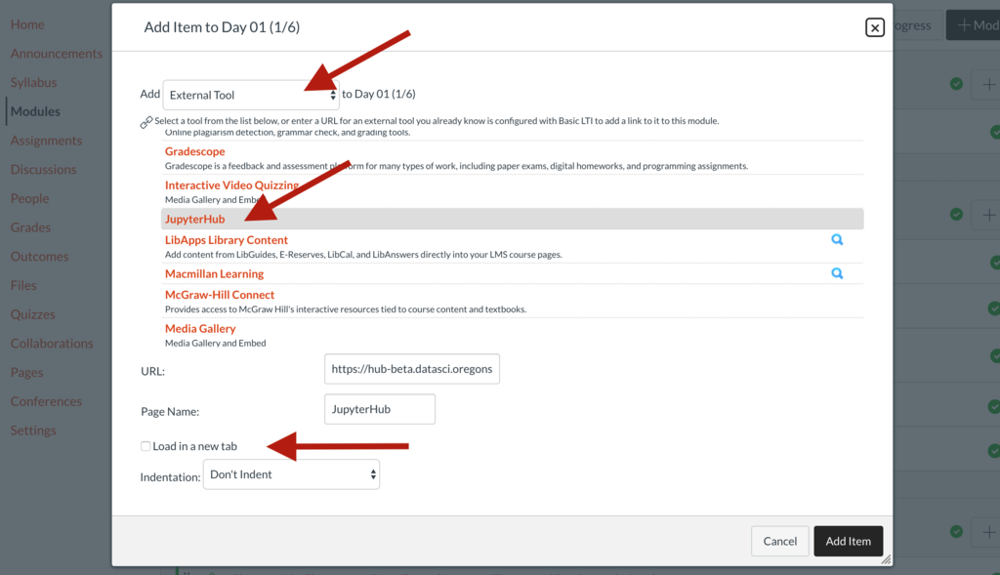
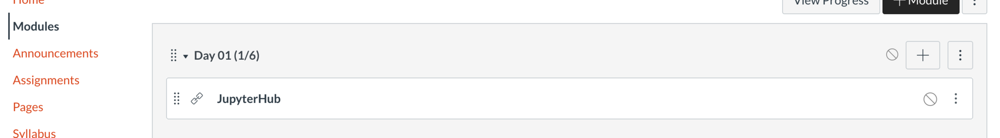
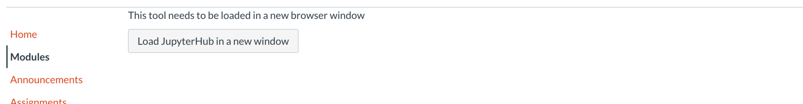

# DS@OSU JupyterHub Canvas Integration Notes

You'll need the following information to connect your Canvas course to your DS@OSU JupyterHub, 
which will be provided via a secure channel (e.g. Box link):

* Launch URL
  * e.g. **https://hub-beta.datasci.oregonstate.edu/lti-demo/hub/lti/launch**
* Consumer Key
  * e.g. **e04bec07b28e311ef3a912137250f6997fca6710958d0ee16aa0add1abbf26e8**
* Shared Secret
  * e.g. **95b51f2412d142c665eaefd2038267895aeff382c8b40e0eea039e136a8db5d3**

## Step 1: Creating the App

First, login to Canvas and open the Course you wish to connect. In the course menu, Select "Settings" near the bottom:

In the "Apps" Tab, click "View App Configurations":

Click the "+ App" Button:

In the window that pops up, enter your Launch URL, Consumer Key, and Shared Secret 
(via copy-and-paste). Also be sure to set the "Privacy" dropdown to Public (this lets the JupyterHub see the usernames of those logging in), and give the new app a name 
(which is part of what students will see in the "launch" button, configured below).

Examples shown:

Once you click the "Submit" button your app is ready for use in other parts of Canvas!

## Step 2: Creating a Launch JupyterHub Button

The Hub can be accessed as a Canvas "External Tool", either as an Assignment, or as a section of a Module. 

### Link from a Module

Click the + to add an Item to the Module. In the window that pops up, use the dropdown to select "External Tool". In the list that appears, find your new app by name; clicking it will fill in the URL and Page Name boxes. (If you have trouble finding the entry in the list, you may try entering the launch URL directly into the URL box.)

You may also want to click the "Load in a new tab" checkbox to indicate that JupyterHub should be launched into a new browser tab.

The resulting view in the Modules list:

And the launch button displayed in the item page:

