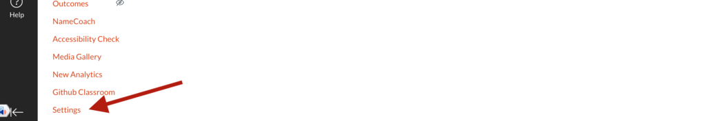

# DS@OSU JupyterHub Canvas Integration Notes

You'll need the following information to connect your Canvas course to your DS@OSU JupyterHub, 
which will be provided via a secure channel (e.g. Box link):

* Launch URL
  * e.g. **https://hub-beta.datasci.oregonstate.edu/lti-demo/hub/lti/launch**
* Consumer Key
  * e.g. **e04bec07b28e311ef3a912137250f6997fca6710958d0ee16aa0add1abbf26e8**
* Shared Secret
  * e.g. **95b51f2412d142c665eaefd2038267895aeff382c8b40e0eea039e136a8db5d3**

## Step 1: Creating the App

First, login to Canvas and open the Course you wish to connect. In the course menu, Select "Settings" near the bottom:

