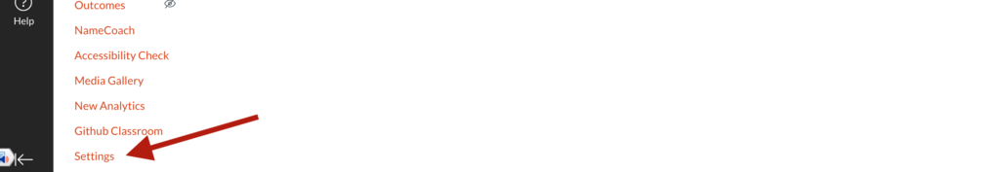
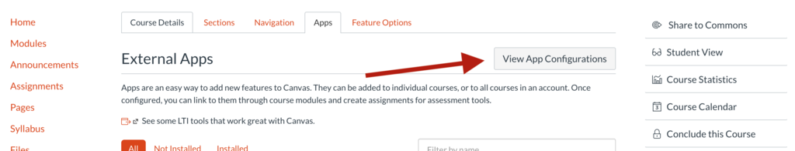
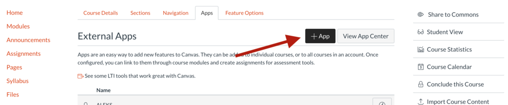
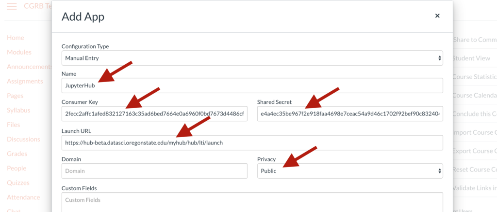
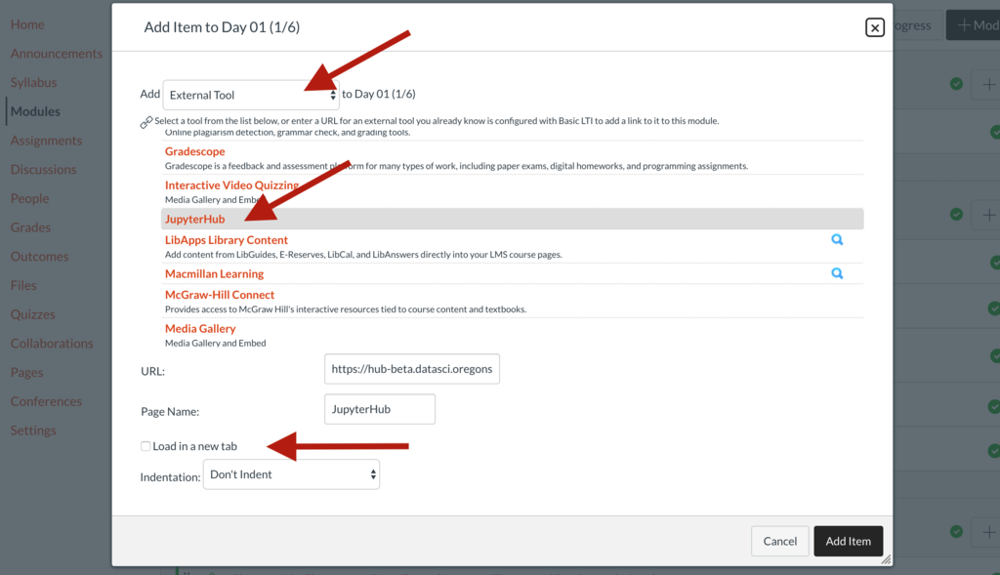
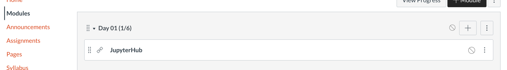
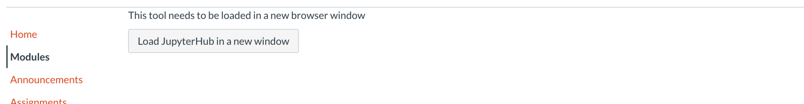
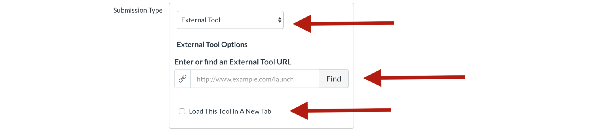
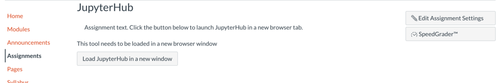
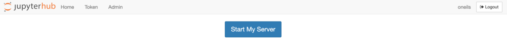

# DS@OSU JupyterHub Canvas Integration Notes

Contents:

   * [DS@OSU JupyterHub Canvas Integration Notes](#dsosu-jupyterhub-canvas-integration-notes)
      * [Step 1: Creating the App](#step-1-creating-the-app)
      * [Step 2: Creating a Launch JupyterHub Button](#step-2-creating-a-launch-jupyterhub-button)
         * [Link from a Module](#link-from-a-module)
         * [Link from an Assignment](#link-from-an-assignment)
      * [Step 3: usage:](#step-3-usage)
         * [Permissions](#permissions)
         * [Resource Usage](#resource-usage)
         * [Student View](#student-view)

If your Hub has been configured for Canvas acces, you'll need the following information to connect your Canvas course to your Hub, which will be 
provided via a secure channel (e.g. Box link):

* Launch URL
  * e.g. **https://hub-beta.datasci.oregonstate.edu/lti-demo/hub/lti/launch**
* Consumer Key
  * e.g. **e04bec07b28e311ef3a912137250f6997fca6710958d0ee16aa0add1abbf26e8**
* Shared Secret
  * e.g. **95b51f2412d142c665eaefd2038267895aeff382c8b40e0eea039e136a8db5d3**

## Step 1: Creating the App

First, login to Canvas and open the Course you wish to connect. In the course menu, Select "Settings" near the bottom:

In the "Apps" Tab, click "View App Configurations":

Click the "+ App" Button:

In the window that pops up, enter your Launch URL, Consumer Key, and Shared Secret (via copy-and-paste). Also be sure to
set the "Privacy" dropdown to Public (this lets the JupyterHub see the usernames of those logging in), and give the new
app a name (which is part of what students will see in the "launch" button, configured below).

Examples shown:

Once you click the "Submit" button your app is ready for use in other parts of Canvas!

## Step 2: Creating a Launch JupyterHub Button

The Hub can be accessed as a Canvas "External Tool", either as an Assignment, or as a section of a Module. 

### Link from a Module

Click the + to add an Item to the Module. In the window that pops up, use the dropdown to select "External Tool". In the
list that appears, find your new app by name; clicking it will fill in the URL and Page Name boxes. (If you have trouble
finding the entry in the list, you may try entering the launch URL directly into the URL box.)

You may also want to click the "Load in a new tab" checkbox to indicate that JupyterHub should be launched into a new
browser tab.

The resulting view in the Modules list:

And the launch button displayed in the item page:

### Link from an Assignment

Linking from a Canvas assignment is similar. First, create a new assignment, and in the Submission Type area select
"External Tool." Use the Find button to find your app by name (or enter the launch URL directly). 

You may want to select "Load This Tool in a New Tab" to have the Hub opened in a new browser tab.  

Here's the resulting assignment page:

## Step 3: usage:

### Permissions

Canvas users with the role of "Instructor" will have administrator privileges in the Hub data space, meaning they can by
view and edit all shared data for the Hub, and install Python and R packages Hub-wide.

Note that user home directories will only be created on first access to the Hub. 

### Resource Usage

When a user first logs in, they will be presented with the "Start my Server" button; click this to start the
cloud-server. (In some cases this can take a few minutes if the cloud-based resources need to be created from scratch,
in which case refreshing the page will work when the server is ready.)

To keep costs low, please encourage your students to log out or close the browser window if they won't be using their
server for an hour or more; doing so marks the server as "inactive" so it can can be shut down (after an hour of
inactivity) and save on computational resources. 

Servers are forcefully stopped after 8 hours of runtime, even if the browser window is not closed. 

### Student View

It is possible to access the hub while in Canvas' "Student View"; when doing so the "fake student" will be given a
randomized username such as `e7762eb458c176d89cbce42eb81e82d9e573182f`. (You may need to first logout of the Hub to clear
your regular login first.) This user has regular student permissions, which can be handy to ensure permissions on hub
data are correct. 

The same randomized ID will be used, unless you click "Reset Student View" in Student View, which creates a new random
ID that will be used.

