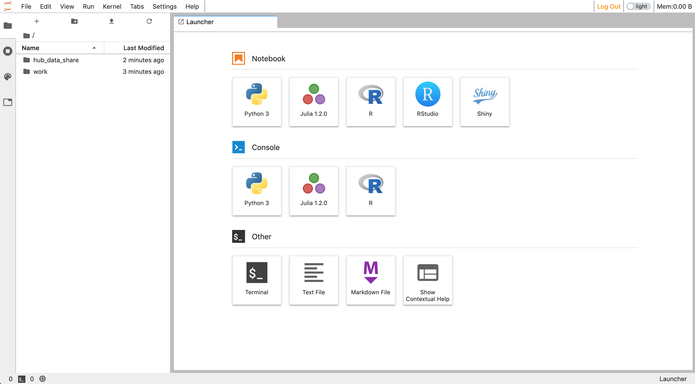
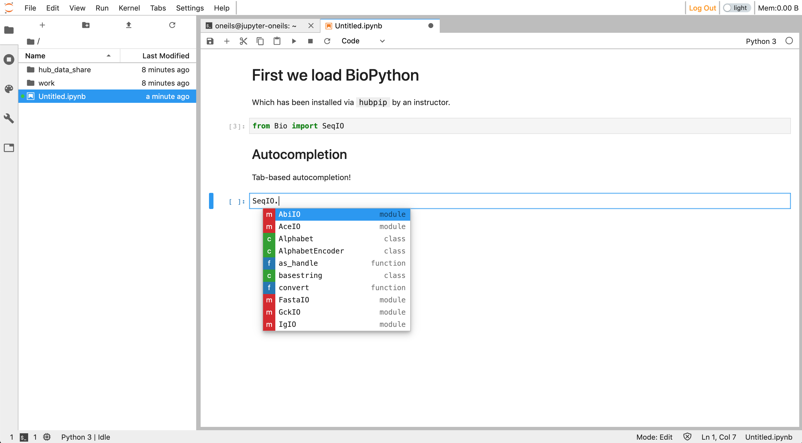
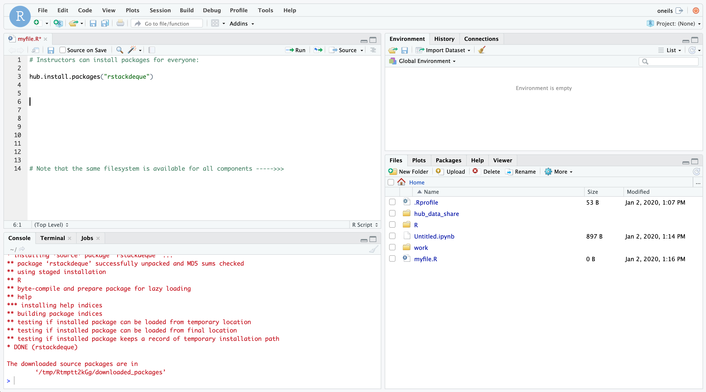
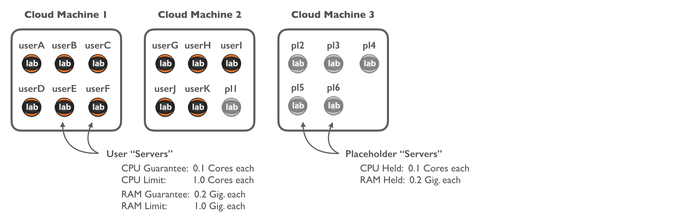
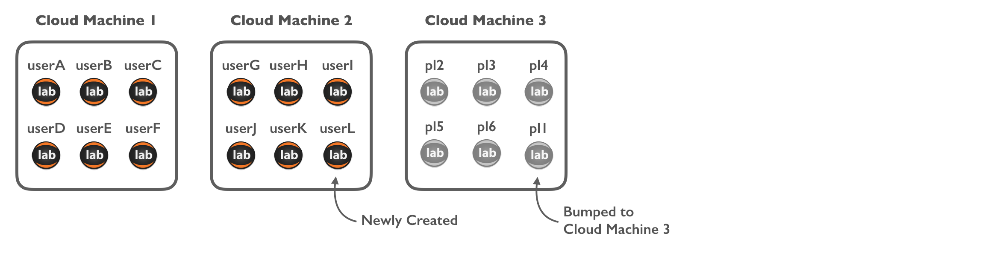
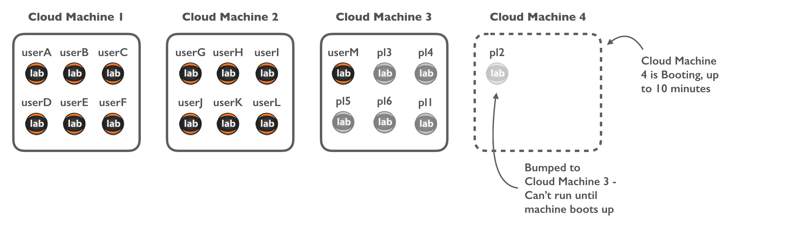
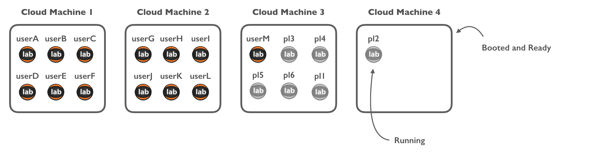
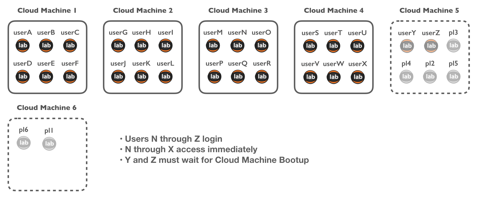
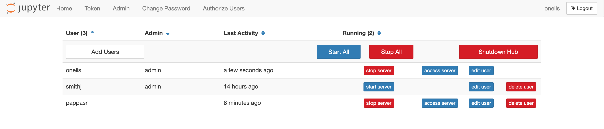

# DataScience@OregonState - Instructor Readme

Contents:

   * [DataScience@OregonState - Instructor Readme](#datascienceoregonstate---instructor-readme)
      * [Features](#features)
      * [QuickStart](#quickstart)
      * [User Server Management](#user-server-management)
         * [Server Termination and Scaling Down](#server-termination-and-scaling-down)


<br />
<br />

## Features

Welcome to the DataScience@OregonState instructional platform. This is still a work in progress, but we're excited to offer:

* A cloud-hosted platform scalable to campus-level needs
* A data analysis & programming environment supporting Python3, R, Julia, Jupyter Notebooks, RStudio, and the Linux command-line
* A large array of pre-installaed Python and R packages ([list](https://jupyter-docker-stacks.readthedocs.io/en/latest/using/selecting.html#jupyter-datascience-notebook))
* The ability for students and instructors/TAs to install Python3 and R packages for their own use
* The ability for instructors to install Python3 packages, R packages, and scripts for use by everyone
* Shared storage with classroom-appropriate permissions:
  * Students can read/write in their own home directories, and have read-only access to a designated `hub_data_share` folder
  * Instructors (or others with designated Admin access) have read+write to student directories and other locations

Some screenshots (Initial JupyterLab Interface, a Python Notebook, and RStudio):

<a href="https://raw.githubusercontent.com/oneilsh/dsosuk8s/userdocs/user_docs/docs_images/instructor_readme/launcher.png"></a>&nbsp;
<a href="https://raw.githubusercontent.com/oneilsh/dsosuk8s/userdocs/user_docs/docs_images/instructor_readme/python_notebook_autocomplete.png"></a>&nbsp;
<a href="https://raw.githubusercontent.com/oneilsh/dsosuk8s/userdocs/user_docs/docs_images/instructor_readme/rstudio.png"></a>

<br />
<br />


## QuickStart

We've designed DS@OSU to balance user-friendliness with flexibility and power. Understanding the sections below 
will help you get the most from the platform. Nevertheless, here are some important notes to help you start playing quickly:

1. **Hubs:** A single "Hub" provides access to a shared environment for members of a class (instructors, TAs, students) at a specific URL, for 
   example `https://beta.datasci.oregonstate.edu/nmc-245/`, and different classes access different Hubs/URLs. Within a Hub, some users
   (instructors & TAs) have "Admin"-level access with special permissions.

2. **Login and User Management:** We currently support two options for user login: the "Native Authenticator" (which supports Hub-managed accounts
   and passwords) and Canvas-based access. For information on using the Native Authenticator, see the [Native Authenticator Readme](README_NATIVEAUTH.md). For information on 
   access via Canvas, see the [Canvas Readme](README_CANVAS.md).

2. **Cloud-Based Servers:** Eacher user's "interface" (shown in the screenshots above) is running as an individual server (Docker container, actually) in 
   the cloud. This has some implications for Admins--for example, user servers may be shut down after a period of inactivity (e.g. 1. hour), or after
   a maximum amount of active time (e.g. 8 hours) to save on resources and costs. 

   Fortunately, user servers start up quickly on login (in a few seconds), *unless* a new cloud-based machine must be created behind-the-scenes to support
   that server. When this happens a delay of up to 10 minutes can occur on login. This is most likely to happen when a large number of students
   attempt to login simultaneously after a period of inactivity, such as at the start of a morning lab class. See section  [User Server Management](#user-server-management)
   below for details on how avoid this and other implications of running in an auto-scaling cloud.

   *Activity*, by the way, means a browser tab open and the user logged in, *even if the user is not doing anything.* You can thus
   help us control costs by instructing your students to logout or close their browser tabs when they won't be using the system for an hour or more.

3. **For Python Users**: Each user can install python3 packages for their own use with `pip install --user packagename`. Admins can install packages "hub-wide"
   (for import by all users) with `hubpip install packagename`. Installed packages are available for import in Jupyter notebooks an on the
   command-line.

4. **For R Users**: Each user can install R packages for their own use with the standard `install.packages("packagename")` function or RStudio packages interface. 
   Github packages can be be installed for individual use with the usual `devtools::install_github("username/packagename")`, and the same
   for BioConductor packages. 

   Admins can install R packages hub-wide to the site-library with the helper functions `hub.install.packages("packagename")`, 
   `hub.install_github("username/packagename")`, and `hub.install_bioconductor("packagename")`. 

5. **File Permissions:** User home directories are located at `/home/username`; 
   files created in user home directories are by default read+write for their owner and Admins, with no access for non-Admin users. Files
   added to `/home/hub_data_share` are by default read+write for Admins and read-only for others. 

6. **For Command-Line Users:** Admins have read+write access to `/home/hub_local`, others have read-only access. Hub-wide Python and R packages are installed to subdirectories 
   here, and the file `/home/hub_local/hubrc` is used to configure the environment for every user on login (akin to lines added to all users' `.bashrc` 
   files; actually `/etc/profile.d/hubrc.sh` is linked to this file). Executable scripts and programs may be placed in `/home/hub_local/bin` (which is added to every users' `$PATH` via the `hubrc` file--if
   compiling software, use `--prefix=/home/hub_local`). Some environment variables reference these locations; `env` shows a list these and others.

6. **Data Storage:** The `/home` directory and all its contents listed above exist on a single shared network drive. Currently there are no per-user
   limits within this space, so theoretically any user can fill the entire space accidentally. (Implementing per-user quotas is [on the todo list](https://github.com/oneilsh/dsosuk8s/issues/28)).
   If the drive fills up, it will interfere with first-time logins and prevent new file creation, but won't result in data loss. You can
   check space used and available by running `df -h /home` in a terminal. Creating a dashboard for space usage is also on the [todo list](https://github.com/oneilsh/dsosuk8s/issues/29).
   
   ```diff
   - Hub storage is not permanent - we will require all data to be removed by 2 weeks after the class end date. 
   ```
   We are working on longer-term and reusable storage options.

7. **Questions or Issues:** If you notice any technical issues or have feature requests, please feel free to log them as GitHub Issues [here](https://github.com/oneilsh/dsosuk8s/issues).
   General questions may be sent directly to `shawn.oneil@cgrb.oregonstate.edu` or `cj.keist@oregonstate.edu`. We'd love to hear from you!

<br />
<br />

## User Server Management

As mentioned in the the QuickStart, each user inteface runs on an individual "server" (this is the term JupyterHub uses-technically
they are Docker containers) as part of an auto-scaling infrastructure. These servers live on cloud-based "machines" (virtual machines). 
Each Hub is configured so that each user server is gauranteed some minimum amount of CPU cores and RAM and a maximum limit of 
CPU cores and RAM it can use. This means only a certain number of user servers can fit on a cloud machine. 

To provide space for new users to login quickly, a number of "placeholder" servers are also run:



Suppose that `userL` logs in, and their personal server isn't already running (it may be, if they were recently logged in); their
personal server bumps a placeholder to another cloud machine (real user servers are not bumpable):



This process is fast, because starting a new user server on an existing cloud machine is fast. Suppose now that `userM` logs in:
this bumps a placeholder from Cloud Machine 3, and `userM` logs in quickly as their user server starts on Machine 3. But now there's 
no place for the bumped placeholder; this triggers the creation of a new Cloud Machine for the placeholder to start on. 



The new placeholder can't actually run until Cloud Machine 4 has fully booted, and this can take up to 10 minutes. Once it does,
however, there's room for 6 more users to login with minimal wait:



Now suppose, however, that 13 new users attempt to login simultaneously (and again, their servers are not already running as they haven't logged
in recently). There is room for 11 of them on running cloud machines (bumping all of the placeholders), but 2 will have to also wait along
with the placeholders for new Cloud Machines to boot up before they can start working.



The placeholder servers are a nice solution when users login over time, but when many users log in simultaneously after a period of inactivity, 
such as at the start of a morning lab class, there may be delays. 

As an Admin, you can avoid this by pre-starting the servers for users of your hub ~20 minutes before the start of a class where this may be
an issue, using the **Start All** button in the hub control panel Admin tab:



This may trigger the creation of a number of cloud machines to hold these user servers, but if done in advance of class students won't have
to wait while these are created.

### Server Termination and Scaling Down

To save on resource usage and costs, the auto-scaling cluster is also configured to scale *down*--remove cloud machines when they aren't needed. 
To avoid interrupting work, this only happens when a cloud machine is running no user servers. 

To help clear out user servers that aren't actively being used, each Hub is configured to terminate a user server if it is inactive (meaning
the interface is not logged into in a browser tab) after some amount of time (1 hour is the default). To facilitate this *we encourage
instructors to encourage their students to logout (or at least close their browser tabs) when they won't be using the system for an hour or more.*

Individual users can also terminate their user servers directly in the hub control panel "Home" tab. Admins can terminate servers of any user in
the Admin tab. 

In addition to the inactivity timeout, each Hub is also configured with a "max server age" parameter (default 8 hours). Any user server--including
those open in browser tabs--will be terminated if it has been running this long. This can be adjusted if necessary, for example if you expect your
students to run computational processes lasting longer than 8 hours. 


