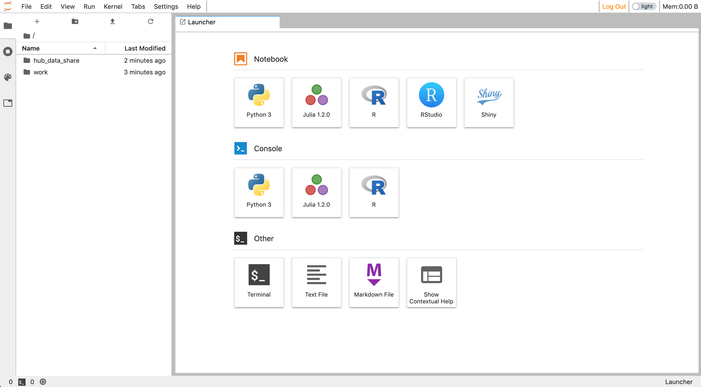

# DataScience@OregonState - Instructor Readme

## Features

Welcome to the DataScience@OregonState instructional platform. This is still a work in progress, but we're excited to offer:

* A cloud-hosted platform scalable to campus-level needs
* A data analysis & programming environment supporting Python3, R, Julia, Jupyter Notebooks, RStudio, and the Linux command-line
* A large array of pre-installaed Python and R packages ([list](https://jupyter-docker-stacks.readthedocs.io/en/latest/using/selecting.html#jupyter-datascience-notebook))
* The ability for students and instructors/TAs to install Python3 and R packages for their own use
* The ability for instructors to install Python3 packages, R packages, and scripts for use by everyone
* Shared storage with classroom-appropriate permissions:
  * Students can read/write in their own home directories, and have read-only access to a designated `hub_data_share` folder
  * Instructors (or others with designated Admin access) have read+write to student directories and other locations

Some screenshots:

