# DataScience@OregonState - Instructor Readme

Contents:

* [Features](#features)
* [QuickStart](#quickstart)
* [Access and User Management](#access-and-user-management)
* [User Server Management](#user-server-management)

 
 

## Features

Welcome to the DataScience@OregonState instructional platform. This is still a work in progress, but we're excited to offer:

* A cloud-hosted platform scalable to campus-level needs
* A data analysis & programming environment supporting Python3, R, Julia, Jupyter Notebooks, RStudio, and the Linux command-line
* A large array of pre-installaed Python and R packages ([list](https://jupyter-docker-stacks.readthedocs.io/en/latest/using/selecting.html#jupyter-datascience-notebook))
* The ability for students and instructors/TAs to install Python3 and R packages for their own use
* The ability for instructors to install Python3 packages, R packages, and scripts for use by everyone
* Shared storage with classroom-appropriate permissions:
  * Students can read/write in their own home directories, and have read-only access to a designated `hub_data_share` folder
  * Instructors (or others with designated Admin access) have read+write to student directories and other locations

Some screenshots (Initial JupyterLab Interface, a Python Notebook, and RStudio):

&nbsp;
<a href="https://raw.githubusercontent.com/oneilsh/dsosuk8s/userdocs/user_docs/images/python_notebook_autocomplete.png">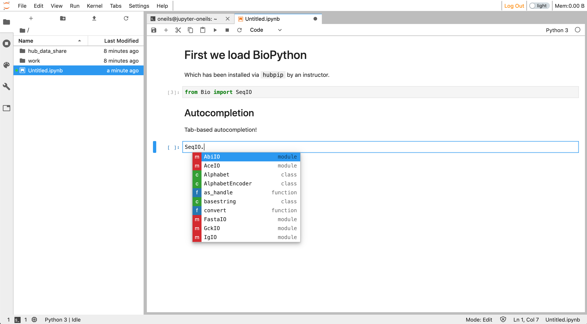</a>&nbsp;
<a href="https://raw.githubusercontent.com/oneilsh/dsosuk8s/userdocs/user_docs/images/rstudio.png">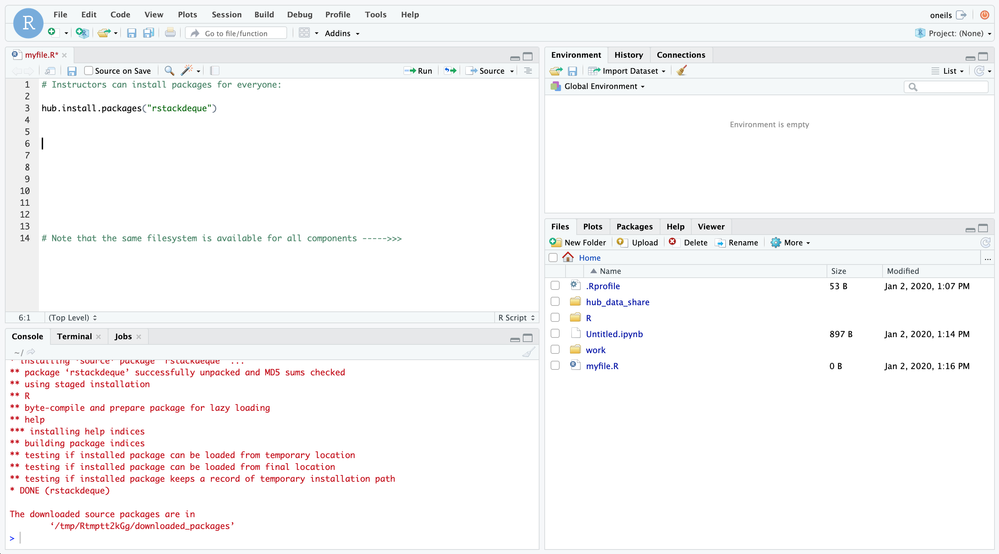</a>

 
 

## QuickStart

We've designed DS@OSU to balance user-friendliness with flexibility and power. Understanding the sections below 
will help you get the most from the platform. Nevertheless, here are some important notes to help you start playing quickly:

1. **Hubs:** A single "Hub" provides access to a shared environment for members of a class (instructors, TAs, students) at a specific URL, for 
   example `https://beta.datasci.oregonstate.edu/nmc-245/`, and different classes access different Hubs/URLs. Within a Hub, some users
   (instructors & TAs) have "Admin"-level access with special permissions.

2. **Login and User Management:** We don't yet have ONID or single-sign-on integration. In the meantime, the workflow is for students to request
   access by signing up to a Hub with their preferred username and password, after which an Admin user can authorize them to login. For details on this
   process, be sure to see section [Access and User Management](#access-and-user-management) below. 

2. **Cloud-Based Servers:** Eacher user's "interface" (shown in the screenshots above) is running as an individual server (Docker container, actually) in 
   the cloud. This has some implications for Admins--for example, user servers may be shut down after a period of inactivity (e.g. 1. hour), or after
   a maximum amount of active time (e.g. 8 hours) to save on resources and costs. 

   Fortunately, user servers start up quickly on login (in a few seconds), *unless* a new cloud-based machine must be created behind-the-scenes to support
   that server. When this happens a delay of up to 10 minutes can occur on login. This is most likely to happen when a large number of students
   attempt to login simultaneously after a period of inactivity, such as at the start of a morning lab class. See section  [User Server Management](#user-server-management)
   below for details on how avoid this and other implications of running in an auto-scaling cloud.

   *Activity*, by the way, means a browser tab open and the user logged in, *even if the user is not doing anything.* You can thus
   help us control costs by instructing your students to logout or close their browser tabs when they won't be using the system for an hour or more.

3. **For Python Users**: Each user can install python3 packages for their own use with `pip install --user packagename`. Admins can install packages "hub-wide"
   (for import by all users) with `hubpip install packagename`. Installed packages are available for import in Jupyter notebooks an on the
   command-line.

4. **For R Users**: Each user can install R packages for their own use with the standard `install.packages("packagename")` function or RStudio packages interface. 
   Github packages can be be installed for individual use with the usual `devtools::install_github("username/packagename")`, and the same
   for BioConductor packages. 

   Admins can install R packages hub-wide to the site-library with the helper functions `hub.install.packages("packagename")`, 
   `hub.install_github("username/packagename")`, and `hub.install_bioconductor("packagename")`. 

5. **File Permissions:** User home directories are located at `/home/username`; 
   files created in user home directories are by default read+write for their owner and Admins, with no access for non-Admin users. Files
   added to `/home/hub_data_share` are by default read+write for Admins and read-only for others. 

6. **For Command-Line Users:** Admins have read+write access to `/home/hub_local`, others have read-only access. Hub-wide Python and R packages are installed to subdirectories 
   here, and the file `/home/hub_local/hubrc` is used to configure the environment for every user on login (akin to lines added to all users' `.bashrc` 
   files). Executable scripts and programs may be placed in `/home/hub_local/bin` (which is added to every users' `$PATH` via the `hubrc` file--if
   compiling software, use `--prefix=/home/hub_local`). Some environment variables reference these locations; `env` shows a list these and others.

6. **Data Storage:** The `/home` directory and all its contents listed above exist on a single shared network drive. Currently there are no per-user
   limits within this space, so theoretically any user can fill the entire space accidentally. (Implementing per-user quotas is [on the todo list](https://github.com/oneilsh/dsosuk8s/issues/28)).
   If the drive fills up, it will interfere with first-time logins and prevent new file creation, but won't result in data loss. You can
   check space used and available by running `df -h /home` in a terminal. Creating a dashboard for space usage is also on the [todo list](https://github.com/oneilsh/dsosuk8s/issues/29).

7. **Questions or Issues:** If you notice any technical issues or have feature requests, please feel free to log them as GitHub Issues [here](https://github.com/oneilsh/dsosuk8s/issues).
   General questions may be sent directly to `shawn.oneil@cgrb.oregonstate.edu` or `cj.keist@oregonstate.edu`. We'd love to hear from you!

 
 

## Access and User Management (Non-SSO)

User management and access are in development--we don't yet have ONID or single-sign-on (SSO) integration, 
and the login system we do have is a little clunky. Please bear with us while we work on integrating DS@OSU with other campus services.

#### Initial Instructor (Admin) Access

In it's current form, when a Hub is created for a class, specific usernames (e.g. the instructor `smithj` and TA `oneils`) are designated 
as Admin users. 

When accessing the Hub URL (e.g. `https://beta.datasci.oregonstate.edu/nmc-245`) for the first time, you'll see the login page...

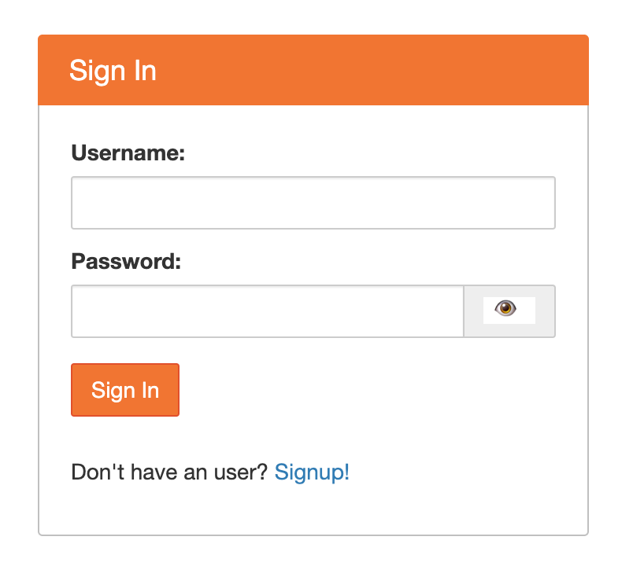

... but, you won't be able to login (even as an Admin) unless you set a password. To do so, click the **Signup!** link to get to the signup page:

 
Here, enter your username (e.g. `smithj`) and your chosen password, then click **Create User**. The box will clear and let you know your information
has been submitted. 

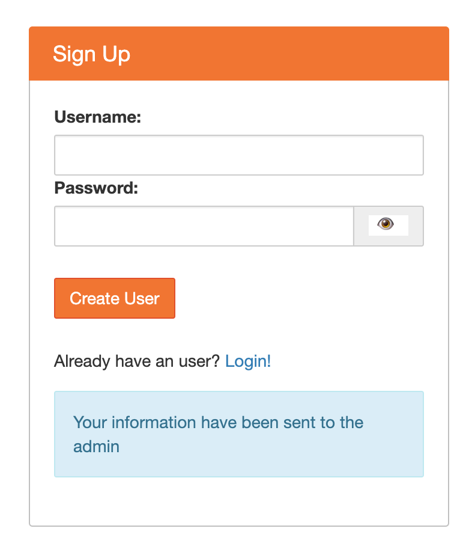

Now, click the **Login!** link to return to the login page, and login with your username and chosen password. Admins are pre-authorized to login, so
you'll be logged into the JupyterLab interface.

#### Authorizing Others

The process for other users (students and new TAs or co-instructors) wishing to access the hub is similar - they will visit the Signup page
and choose a username and password. However, they won't be able to login until their access is authorized by an Admin. 

In the JupyterLab interface, every user has access to their "Hub Control Panel" from the File menu.

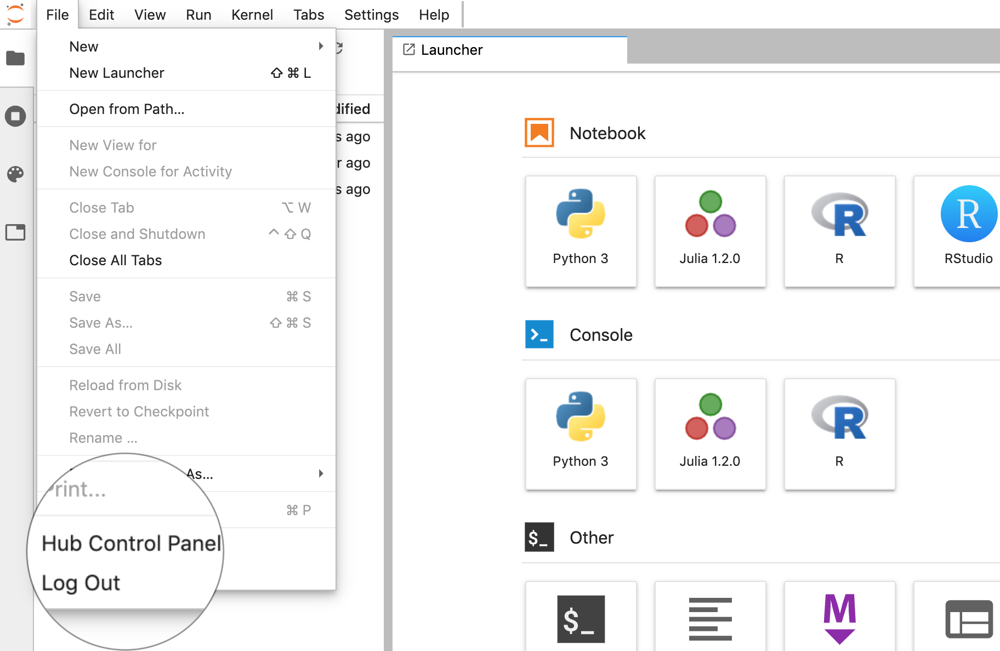

When the control panel opens, the page will look like so:

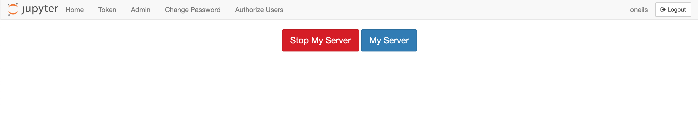

Non-admin users will only see tabs for "Home", "Token" and "Change Password", *not* "Admin" or "Authorize Users".

Visiting the "Authorize Users" tab shows a list of usernames and their authorized status; clicking "Authorize" or "Unauthorize"
changes their status. 

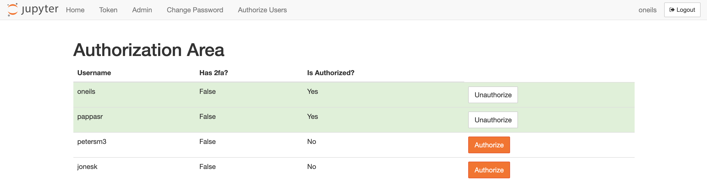

Once authorized they will be able to login; by default newly authorized users are not Admins (though that can be changed). 

#### Managing Users (Removing and Changing Admin Status)

The "Admin" tab of the control panel shows a list of users that *have previously logged in*, whether they are authorized or not. 
This means that users that are authorized but have not logged in yet will not be shown here, and users that have been de-authorized may 
still show in this list (but they won't be able to login again until re-authorized). If you need to see entries for not-yet-logged-in
users, you can add their usernames manually with the **Add Users** button. 

Users can be removed with the **Delete User** button. *This does not delete their data in their `/home/username` directory.* It merely removes
their password and authorization status. To regain access, they can go through the signup and authorization process again. 

To change a users' Admin status, click **Edit User**--a checkbox will be available in the popup to make them Admin. 

The "server" buttons will be covered below in section [User Server Management](#user-server-management). 

#### Password Changes and Resets

Any user can change their own password by opening their hub control panel and selecting the "Change Password" tab. 

An Admin can reset a users' password, but the process is simply to 1) delete the user from the "Admin" tab, 2) request that they visit
the Signup page again (where they can choose the same username and a new password), and then 3) re-authorize the login. Because
deleting a user does not remove data in their `/home/username` directory, this is effectively a password reset (provided they choose
the same username to re-signup with). 

 
 

## User Server Management

As mentioned in the the QuickStart, each user inteface runs on an individual "server" (this is the term JupyterHub uses-technically
they are Docker containers) as part of an auto-scaling infrastructure. These servers live on cloud-based "machines" (virtual machines). 
Each Hub is configured so that each user server is gauranteed some minimum amount of CPU cores and RAM and a maximum limit of 
CPU cores and RAM it can use. This means only a certain number of user servers can fit on a cloud machine. 

To provide space for new users to login quickly, a number of "placeholder" servers are also run:

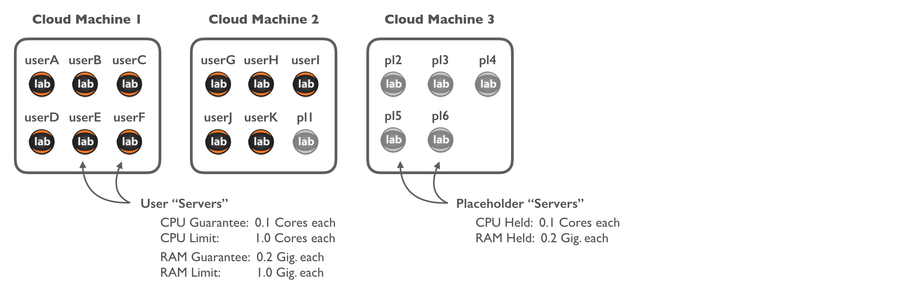

Suppose that `userL` logs in, and their personal server isn't already running (it may be, if they were recently logged in); their
personal server bumps a placeholder to another cloud machine (real user servers are not bumpable):

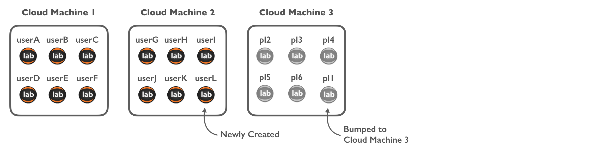

This process is fast, because starting a new user server on an existing cloud machine is fast. Suppose now that `userM` logs in:
this bumps a placeholder from Cloud Machine 3, and `userM` logs in quickly as their user server starts on Machine 3. But now there's 
no place for the bumped placeholder; this triggers the creation of a new Cloud Machine for the placeholder to start on. 

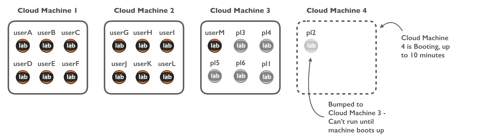

The new placeholder can't actually run until Cloud Machine 4 has fully booted, and this can take up to 10 minutes. Once it does,
however, there's room for 6 more users to login with minimal wait:

Now suppose, however, that 13 new users attempt to login simultaneously (and again, their servers are not already running as they haven't logged
in recently). There is room for 11 of them on running cloud machines (bumping all of the placeholders), but 2 will have to also wait along
with the placeholders for new Cloud Machines to boot up before they can start working.

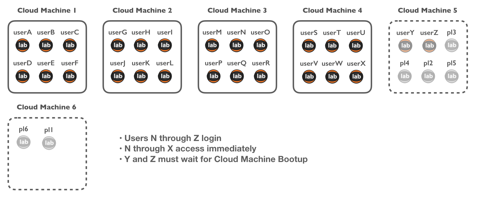

The placeholder servers are a nice solution when users login over time, but when many users log in simultaneously after a period of inactivity, 
such as at the start of a morning lab class, there may be delays. 

As an Admin, you can avoid this by pre-starting the servers for users of your hub ~20 minutes before the start of a class where this may be
an issue, using the **Start All** button in the hub control panel Admin tab:

This may trigger the creation of a number of cloud machines to hold these user servers, but if done in advance of class students won't have
to wait while these are created.

