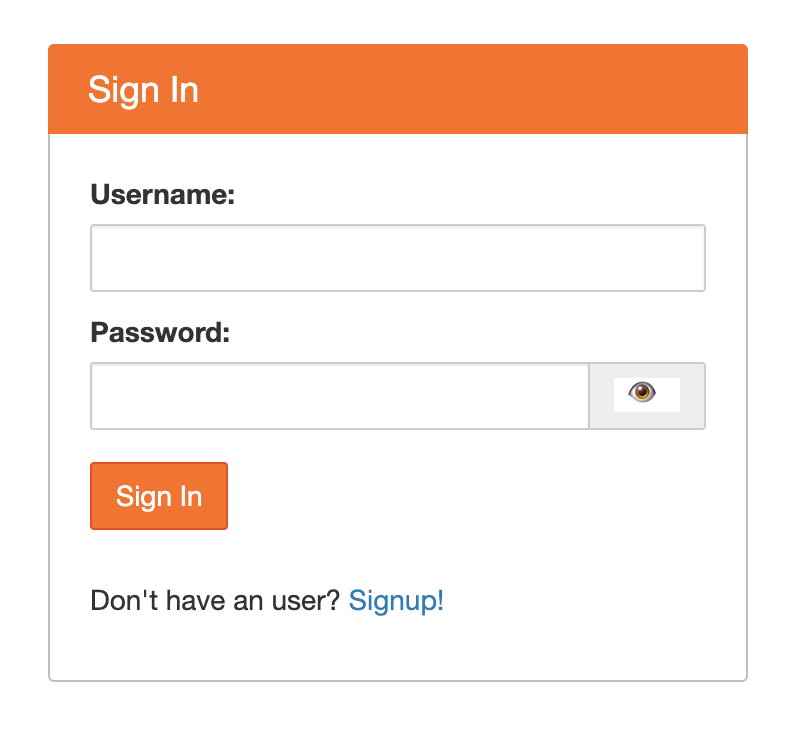
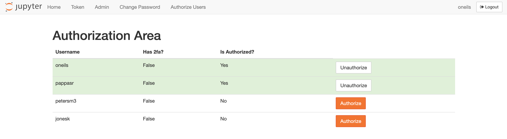

# DS@OSU JupyterHub 'Native Authenticator' Notes

Contents:

   * [DS@OSU JupyterHub 'Native Authenticator' Notes](#dsosu-jupyterhub-native-authenticator-notes)
      * [Initial Instructor (Admin) Access](#initial-instructor-admin-access)
      * [Authorizing Others](#authorizing-others)
      * [Managing Users (Removing and Changing Admin Status)](#managing-users-removing-and-changing-admin-status)
      * [Password Changes and Resets](#password-changes-and-resets)

For class use, the [Canvas-based](README_CANVAS.md) login provides the smoothest experience for students and instructors. (ONID-based login without
Canvas is still in development.)

Where Canvas-based access is not possible, the Native Authenticator allows Hub administrators to manage independent accounts, where login information
(usernames and encrypted passwords) are stored within the Hub itself. 

## Initial Instructor (Admin) Access

When a Hub is created using the Native Authenticator, specific usernames (e.g. the instructor `smithj` and TA `oneils`) may be designated 
as Admin users. Admin users must set their password before they can successfully log in.

When accessing the Hub URL (e.g. `https://beta.datasci.oregonstate.edu/nmc-245`) for the first time, you'll see the login page...

... but, you won't be able to login (even as an Admin) unless you set a password. To do so, click the **Signup!** link to get to the signup page:

 
Here, enter your username (e.g. `smithj`) and your chosen password, then click **Create User**. The box will clear and let you know your information
has been submitted. 

Now, click the **Login!** link to return to the login page, and login with your username and chosen password. Admins are pre-authorized to login, so
you'll be logged into the JupyterLab interface.

## Authorizing Others

The process for other users (students and new TAs or co-instructors) wishing to access the hub is similar - they will visit the Signup page
and choose a username and password. However, they won't be able to login until their access is authorized by an Admin. 

In the JupyterLab interface, every user has access to their "Hub Control Panel" from the File menu.

When the control panel opens, the page will look like so:

Non-admin users will only see tabs for "Home", "Token" and "Change Password", *not* "Admin" or "Authorize Users".

Visiting the "Authorize Users" tab shows a list of usernames and their authorized status; clicking "Authorize" or "Unauthorize"
changes their status. 

Once authorized they will be able to login; by default newly authorized users are not Admins (though that can be changed). 

## Managing Users (Removing and Changing Admin Status)

The "Admin" tab of the control panel shows a list of users that *have previously logged in*, whether they are authorized or not. 
This means that users that are authorized but have not logged in yet will not be shown here, and users that have been de-authorized may 
still show in this list (but they won't be able to login again until re-authorized). If you need to see entries for not-yet-logged-in
users, you can add their usernames manually with the **Add Users** button. 

Users can be removed with the **Delete User** button. *This does not delete their data in their `/home/username` directory.* It merely removes
their password and authorization status. To regain access, they can go through the signup and authorization process again. 

To change a users' Admin status, click **Edit User**--a checkbox will be available in the popup to make them Admin. 

The "server" buttons will be covered below in section [User Server Management](#user-server-management). 

## Password Changes and Resets

Any user can change their own password by opening their hub control panel and selecting the "Change Password" tab. 

An Admin can reset a users' password, but the process is simply to 1) delete the user from the "Admin" tab, 2) request that they visit
the Signup page again (where they can choose the same username and a new password), and then 3) re-authorize the login. Because
deleting a user does not remove data in their `/home/username` directory, this is effectively a password reset (provided they choose
the same username to re-signup with). 

